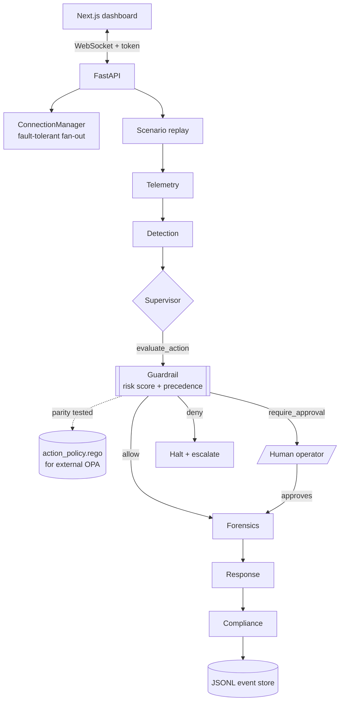

# A-SOC — Agentic Security Operations Centre

A security incident simulation with a real policy guardrail: scripted attack
scenarios stream to a live dashboard, and every proposed remediation is gated by
a risk-scored allow / require-approval / deny decision before it can run.

[](https://github.com/daniellopez882/Autonomous-Secure-AI-Operations-Center/actions/workflows/ci.yml)
[](https://github.com/daniellopez882/Autonomous-Secure-AI-Operations-Center/actions/workflows/security.yml)

> **What this is.** The agents replay scripted scenarios; they do not call an
> LLM and do not touch a real cloud account. What *is* real is the guardrail,
> the WebSocket transport, the LangGraph workflow and the policy parity tests.
> [`a-soc/docs/status.md`](a-soc/docs/status.md) lists exactly what runs and
> what is stubbed. Read it before evaluating any claim here.

---

## Why this exists

The interesting problem in autonomous remediation is not detection. It is
deciding, safely, whether a machine may act on its own — and being able to
show afterwards why it was allowed to.

A-SOC models that decision as a first-class component. An agent proposes an
action; a guardrail scores it, applies precedence rules, and returns a verdict
with its reasoning attached. Destructive actions always need a human.
Catastrophic ones cannot be approved at all.

## Architecture



Every box exists in the code. `core/orchestration/workflow.py` builds the same
flow as a compiled LangGraph `StateGraph`.

## The guardrail

This is the part worth reading. A proposed action is resolved to a canonical
type, scored, and judged in strict precedence:

| Order | Rule | Result |
|---|---|---|
| 1 | Destructive **and** score ≥ 0.95, no emergency override | `deny` — approval cannot override it |
| 2 | Score ≥ 0.5, **or** the action is destructive | `require_approval` |
| 3 | Otherwise | `allow` |

```bash
curl "localhost:8000/api/v1/policy/evaluate?action_type=IAM_REVOKE"
```

```json
{"decision": "require_approval", "risk_score": 0.8, "risk_level": "critical",
 "action_type": "IAM_REVOKE",
 "reasons": ["base risk for IAM_REVOKE scored 0.80 (critical)",
             "action is destructive and cannot be automatically undone",
             "score 0.80 >= 0.5"],
 "audit_required": true}
```

Deny is checked **before** approval, deliberately: an operator must not be able
to wave through a catastrophic action by clicking a button.

The `.rego` policy is the deployable artefact for an external OPA sidecar.
`TestRegoParity` asserts its thresholds, destructive set and aliases match the
Python authority, so the two cannot drift apart silently.

## What was fixed

The guardrail described above did not previously run. This is the substance of
the current revision:

| Defect | Consequence |
|---|---|
| `RiskScorer` imported by nothing; the rego policy evaluated by nothing | The project's central security control was dead code |
| The live gate was `if risk_score > 0.6:  # Threshold for demo` | A magic number stood in for the policy engine |
| Three disagreeing thresholds: scorer `0.5`, api.py `0.6`, workflow `0.8` | No single answer to "would this action be allowed?" |
| Scenario actions `ISOLATE_INSTANCE` / `BLOCK_IP` absent from the scoring table | They silently took the 0.5 default |
| `broadcast()` aborted the loop on one dead client | Every later client got nothing, and the dead socket poisoned all future broadcasts. Because `background_telemetry()` calls it in a bare `while True`, **the live feed died permanently the first time any tab closed** |
| `disconnect()` used `list.remove()` | `ValueError` for a socket that was never registered |
| `core/orchestration/workflow.py` used `from ...agents...` | `ImportError: attempted relative import beyond top-level package` — the advertised LangGraph orchestration could never load |
| `Dockerfile` ran `main.py` | A one-shot CLI demo. The container printed and exited; nothing ever listened on port 8000 |
| Workflow lived at `a-soc/.github/workflows/` | GitHub only reads the repo root — **CI had never executed once** |
| Test step carried `continue-on-error: true` | A failing suite could not fail the build |
| `requirements.txt` pinned nothing, 27 bare names | Non-reproducible installs; pytest, black and mypy shipped into the image |
| 20 `.pyc` files committed, no `.gitignore` | — |
| `asyncio.create_task` with no stored reference | The polling task could be garbage-collected mid-flight |
| `datetime.utcnow()` throughout | Deprecated since 3.12; returns naive datetimes that compare wrong against aware ones |

## Quick start

```bash
git clone https://github.com/daniellopez882/Autonomous-Secure-AI-Operations-Center.git
cd Autonomous-Secure-AI-Operations-Center/a-soc
cp .env.example .env
docker compose up --build
```

Backend on `:8000`, dashboard on `:3000`. Without Docker:

```bash
python -m venv .venv && .venv/bin/pip install -r requirements-dev.txt
.venv/bin/uvicorn api:app --reload
.venv/bin/pytest
```

## API

| Method | Path | Auth | Purpose |
|---|---|---|---|
| GET | `/health` | none | Liveness. Touches no dependency. |
| GET | `/ready` | none | Readiness: telemetry task alive, guardrail answering, WS auth configured |
| GET | `/api/v1/policy/evaluate` | none | Judge an action without executing it |
| WS | `/ws/threat-feed` | `?token=` when configured | Incident stream; accepts `START_SIMULATION`, `APPROVE_ACTION` |

## Configuration

Environment-driven; see [`a-soc/.env.example`](a-soc/.env.example).

| Variable | Default | Notes |
|---|---|---|
| `ENVIRONMENT` | `development` | `production` hides `/docs` and requires `WS_AUTH_TOKEN` |
| `CORS_ALLOW_ORIGINS` | localhost in dev | Was hardcoded to two localhost ports |
| `WS_AUTH_TOKEN` | unset | Optional in dev; `/ready` reports unready without it in production |
| `SIMULATION_STEP_SECONDS` | `1.5` | Set to `0` in tests |

## Testing

```bash
cd a-soc && pytest
```

88 tests: guardrail decision table, rego parity, WebSocket resilience, workflow
routing, API contract. There were none before.

## Security

Implemented: constant-time WebSocket token check, configurable CORS allowlist,
query-parameter length caps, non-root container, `pip-audit` + `bandit` +
`gitleaks` in CI, and the guardrail itself.

**Not implemented:** the HTTP API has no authentication. `/api/v1/policy/evaluate`
is read-only and side-effect free, but `/health` and `/ready` disclose
operational state to anyone who can reach them. Put this behind an
authenticating proxy before exposing it.

## Limitations

- **The agents are stubs.** No LLM is called. See [`docs/status.md`](a-soc/docs/status.md).
- **No cloud integration.** boto3 and the Kubernetes client are declared and constructed, never used to make a call.
- **Postgres, Redis, Pinecone and Vault are configured but unwired.**
- **The event store is a local JSONL file** — appended to, but not immutable, signed or replicated, so it does not meet the compliance bar the code's docstrings imply.
- **The dashboard is untested.** CI builds it; nothing asserts its behaviour.
- **No load testing.** Fan-out is bounded by `asyncio.gather` across all clients with a per-send timeout; it has not been measured under many connections.

## Roadmap

1. Provider-abstracted LLM behind `DetectionAgent`, canned response as offline fallback
2. Persist incidents and verdicts to the already-configured Postgres
3. Evaluate the rego through a live OPA sidecar and compare at runtime, not only in tests
4. Authentication on the HTTP API
5. Load test the WebSocket fan-out and publish the numbers

## Documentation

| Document | What it records |
|---|---|
| [`a-soc/docs/status.md`](a-soc/docs/status.md) | What is implemented and tested, what is simulated, what is declared but not wired |
| [ADR 0001](a-soc/docs/adr/0001-one-guardrail-authority.md) | One guardrail authority; deny before approval; the rego is pinned to it by parity tests and OPA in CI |
| [ADR 0002](a-soc/docs/adr/0002-the-simulation-is-the-product.md) | The simulation is the product; `status.md` is the contract for what runs |
| [Threat model](a-soc/docs/threat-model.md) | Eight threats with what was open, what is closed, and what remains; the boundaries; the failure modes that fail closed |

## Repository layout

```
.github/workflows/   CI and security pipelines (at the root, so they run)
a-soc/
  api.py             FastAPI app: probes, policy endpoint, WebSocket
  guardrails/        decision engine, risk scorer, rego policy
  core/
    realtime/        fault-tolerant WebSocket fan-out
    orchestration/   LangGraph StateGraph
    simulation/      scenario definitions
    config/          typed settings
  agents/            six agent classes (stubbed; see docs/status.md)
  docs/              status.md, ADRs, threat model
  dashboard/         Next.js UI
  k8s/               manifests (not applied by anything here)
  tests/             unit and integration
```

## License

MIT — see [LICENSE](LICENSE).
