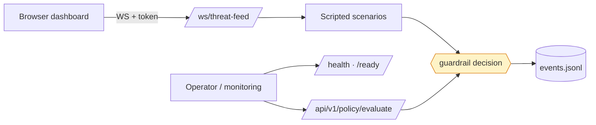

# Threat model

Scope: the FastAPI service in `a-soc/` (`/health`, `/ready`,
`/api/v1/policy/evaluate`, the `/ws/threat-feed` WebSocket), the guardrail it
serves, the dashboard that consumes the feed, and the local JSONL event
store. Out of scope: the cloud integrations, because none is wired
([status.md](status.md)).

What was open when the work started is stated per threat; "now" is the
state on the `production-readiness` branch.

| # | Threat | Was | Now | Remaining |
|--:|---|---|---|---|
| T1 | A destructive action executes without the policy intended | The gate was `if risk_score > 0.6:  # Threshold for demo`; the scorer and the rego were dead code; two scenario actions took a silent 0.5 default | One authority (`guardrails/decision.py`), deny before approval, closed action table, rego parity tested and the rego evaluated under OPA in CI ([ADR 0001](adr/0001-one-guardrail-authority.md)) | Policy content itself is a product decision; the table is small and reviewed by hand |
| T2 | Anyone reaching the port reads the live incident feed | The WebSocket was unauthenticated | Optional `WS_AUTH_TOKEN`, compared in constant time. With no token configured the feed is open in development and **every WebSocket connection is refused in production**; `/ready` reports the gate's state | The HTTP routes have no auth. They expose probes and a read-only policy evaluation — no state changes — so the exposure is information, not action. Adding the same token check to `/api/v1/policy/evaluate` is one dependency |
| T3 | One client kills the feed for everyone | `broadcast()` awaited each `send_json` in a bare loop; one dead socket starved the rest and `background_telemetry()` never recovered | Per-client timeouts, dead clients pruned, `disconnect()` tolerant of unknown sockets; regression tests in `test_connection_manager.py` | A slow client is dropped rather than throttled |
| T4 | The audit trail is trusted more than it deserves | `event_store.py` docstring implied an immutable compliance record | Documented as an append-only local JSONL file: not signed, not replicated, writable by the process user | Real tamper-evidence needs an external sink; not built |
| T5 | Secrets in the image or the repository | `.pyc` files committed; dev tooling in the runtime image; root user | Multi-stage image, runtime deps only, `USER asoc` (uid 1001), `.gitignore`; `security.yml` runs dependency, static and secret scans | Secret scanning covers the tree, not history |
| T6 | Configuration that silently does the wrong thing | `JSON_LOGS` ignored because logging was configured before settings loaded; `datetime.utcnow()` naive timestamps | Logging configured in the lifespan; timezone-aware timestamps; typed settings with `is_production` | — |
| T7 | Cross-origin abuse of the API from a browser | CORS origins were hardcoded for a dev port | `CORS_ALLOW_ORIGINS` from configuration: the dev origins by default in development, **empty in production** unless set; credentials are allowed only for those origins | The WebSocket token travels as a query parameter, which appears in access logs — a header would be better once the dashboard can send one |
| T8 | The system is mistaken for what its README said it was | "Autonomous SOC" over hardcoded findings | `docs/status.md` and the README state what is implemented, simulated and inert ([ADR 0002](adr/0002-the-simulation-is-the-product.md)) | — |

## Trust boundaries

Everything to the right of the WebSocket runs in one process with no
outbound network calls. The only inbound trust decision is the WebSocket
token; the only state is the JSONL file on the container's filesystem.

## Failure modes that fail closed

- Production start without `WS_AUTH_TOKEN`: refused.
- Unknown action name: a test failure, never a default score.
- A `deny` verdict: not overridable by approval.
- OPA parity broken: CI fails (`policy` job).
